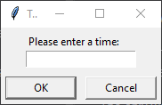
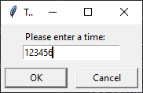
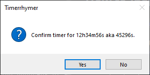
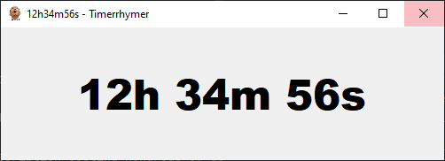

## Table of Contents
1. [Let's Get Right Into It](#lets-get-right-into-it)
   1. [Let's Go Through An Example](#lets-go-through-an-example)
   2. [The Beauty...](#the-beauty)
   3. [Uses](#uses)
2. [How to Install](#how-to-install)
3. [More Tools From Me](#more-tools-from-me)
4. [Support](#support)


## Let's Get Right Into It

It's quite straight forward.



What makes _Timerrhymer_ unique (apart from its astonishing display of beauty) is the way the time is formatted.

A table with examples should be clearer than any explanation:

| Input  | Rendered Time |
|--------|---------------|
|        |               |
| 45     | 45s           |
| 130    | 1m 30s        |
| 4500   | 45m 00s       |
| 13000  | 1h 30m 00s    |
| 123456 | 12h 34m 56s   |

You can even enter things like 90 seconds or 90 minutes.

| Input | Rendered Time |
|-------|---------------|
|       |               |
| 90    | 1m 30s        |
| 9000  | 1h 30m 00s    |
| 9090  | 1h 31m 30s    |

You can also add spaces wherever you like, if that's what you're into.

| Input                         | Rendered Time |
|-------------------------------|---------------|
|                               |               |
| 13000                         | 1h 30m 00s    |
| 1 30 00                       | 1h 30m 00s    |
| &nbsp; 13 &ensp; 0 &ensp; 0 0 | 1h 30m 00s    |
<br>

### Let's Go Through An Example!

Let's say we want a timer for 12h 34m 56s. So we enter:



and hit _enter_, or click _OK_ if our keyboard fell out of a skyscraper.
<br>

Then, _Timerrhymer_ is nice enough to inform us of the result of the time we entered and asking us for confirmation.



In this example you can clearly see why this time format is substantially simpler than entering the required seconds for example.
<br>

Since the formatted time is correct, let's hit _enter_ again.



And there we go! Our timer is running, happily ticking away wherever you like to put it. Minimizing it works just fine as well of course.

Hovering over the windows icon in the taskbar shows us the remaining time as well.

And once the time runs out, _Timerrhymer_ gently informs us of this matter by coming into the foreground and playing a sweet lullaby to gently pry our attention away from whatever we were doing.

To close the window once the alarm goes off, bring it into focus and press _space_, _enter_ or _escape_, and _Timerrhymer_ will shut down.

### The Beauty...

...lies in its simplicity.

So _Timerrhymer_'s whole lifecycle looks like this:
1. start _Timerrhymer_
2. enter time
3. hit _enter_ 2 times

and you're done! Timer's going, and you can go along your business again as well, a matter of 5 seconds.


### Uses

The core uses for _Timerrhymer_ are
- doing something for _n_ minutes <br>
or
- doing something in _n_ minutes

Examples for my personal primary uses for which I can highly recommend it:

- getting food out of the oven in _n_ minutes
- or out of the pot in _n_ minutes <br>
and
- leaving in _n_ minutes
- relaxing before studying in _n_ minutes and
- studying for _m_ minutes before taking a break (for _n_ minutes before studying for...)


## How to Install

Simply download `Timerrhymer.exe` from the _Releases_ section, and you're good to go! No installation required, not even Python.

The first time running the `.exe` file you might get a warning saying that the app isn't recognized, but after clicking 'More Info' and 'Run anyway' the warning shouldn't pop up anymore.

The only way to get rid of the warning would require me to buy a yearly subscription costing hundreds of euros, and since this is free, open-source software, that isn't in the cards for now.

<br>

Alternatively, if you prefer to use Python to run the program instead, clone the repository and run main.py using a Python environment containing the packages listed in requirements.txt, which can simply be installed by running:

```batch
python -m pip install -r requirements.txt
```


## More Tools From Me

If you enjoyed _Timerrhymer_, feel free to check out my other quality-of-life tools, all free and open-source as well, no ads and no nonsense.

_(coming soon)_
- _ShutDownEr_: xxx
- _BingerBoi_: xxx
- _4Focus_: https://github.com/JohnStephens1/4Focus

## Support

If you found anything useful, sharing them with people who might profit from them as well would be highly appreciated.

Alternatively, any and every donation would mean a lot and help me keep making them.

https://www.paypal.com/donate/?hosted_button_id=L4X2DFAYMJ72U